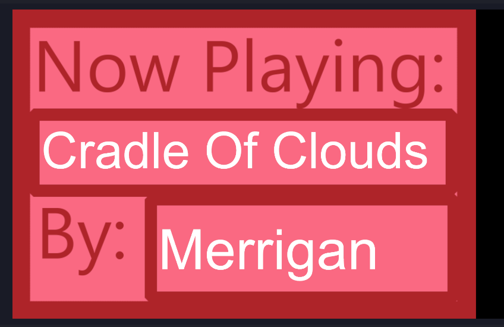

# SpotifyStatus

A simple application that reads the currently playing song from spotify and outputs it to files (to be shown in OBS) or standard out (for use in Mix It Up).
 
## Downloading
You can download this application from the releases page [here](https://github.com/ScottHarwoodTech/SpotifyStatus/releases/latest)

1. Go to the releases page: [here](https://github.com/ScottHarwoodTech/SpotifyStatus/releases/latest)
2. Download the "SpotifyStatus.zip" file
3. Extract all files to a safe place

## Starting

### Stdout Mode
Double click on the `SpotifyStatus.exe` file to run the program in `stdout` mode which means it will output the Artist and Song once a second.

### File Mode
Double Click on the `FileMode.bat` file to run the program in `File` mode which means it will out put the artist and song to local files once a second

## Exiting 

You can exit the application by pressing `control+c` this will automatically exit the application

## Setting Options

You can set the custom options such as:

- `tile-file` Which file to write the title of the song to

- `artist-file` Which file to write the artist of the song to

- `refresh-rate` How frequently to update the song (defaults to one second)

These options can be changed in `FileMode.bat` (right click then `edit`) to point to custom files they can also be passed to the executable as arguments like so:

`SpotifyStatus.exe --title-file="./title.txt" --artist-file="./artist.txt" --refresh-rate=2`

## OBS

You can reference the files updated by SpotifyStatus as text components in OBS. 

In OBS:

1. Add Source
2. Text (GDI+)
3. Set title to `Spotify Artist`
4. Click `ok`
5. Check `Read From File` 
6. Browse to your artist.txt file (defaults to the location where you unzipped Spotify Status)
7. Scale and place as desired

1. Add Source
2. Text (GDI+)
3. Set title to `Spotify Title`
4. Click `ok`
5. Check `Read From File` 
6. Browse to your title.txt file (defaults to the location where you unzipped Spotify Status)
7. Scale and place as desired

## Mix It Up

You can invoke the SpotifyStatus.exe as an external executable within Mix It Up to return the current song title and artist for example using as a `!song` command. 

### !song command example

#### Import Actions
1. Commands -> New Command
2. Set the name to `Now Playing`
3. Set the triggers to `song`
4. Import the actions from `song.miucommand`
5. Open the `Get Song Title` action
6. Browse to where you have extracted `SpotifyStatus.exe` locally
7. Select `SpotifyStatus.exe`

#### Manual setup
1. Commands -> New Command
2. Set the name to `Now Playing`
3. Set the triggers to `song`
4. Add a `external program` action
5. Browse to where you have extracted `SpotifyStatus.exe` locally
6. Select `SpotifyStatus.exe`
7. Check `Wait Until Complete` and `Save Output`
8. Add a `Chat Message` Action
9. Set the message to `Currently Playing: $externalprogramresult`
10. Click the play button to test

## Auto Start When Stream Starts

It would be nice to automatically start `SpotifyStatus` when you start streaming, we can accomplish this through Mix It Up
#### Import Actions

#### Import Actions
1. Events -> Generic 
2. Application Launch
3. Click `Add Command`
4. Import the actions from `autostart.miucommand`
5. Open the `Launch Spotify Status` action
6. Browse to where you have extracted `SpotifyStatus.exe` locally
7. Select `SpotifyStatus.exe`

#### Manual setup
1. Events -> Generic 
2. Application Launch
3. Click `Add Command`
4. Add an `External Progam` action
5. Browse to where you have extracted `SpotifyStatus.exe` locally
6. Select `SpotifyStatus.exe`
7. Set the program arguments to what is stored in `FileMode.bat` or set use the defaults provided
8. Click `Show Window` so that you can close the program when you stop streaming